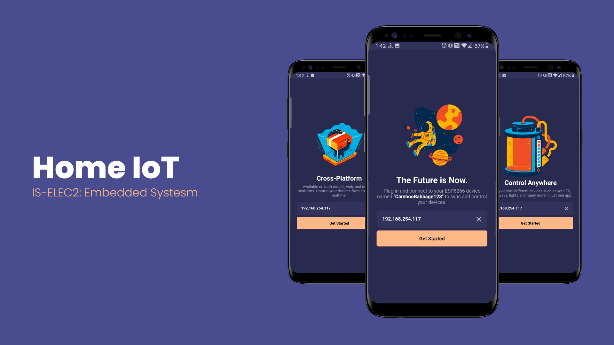

# IS-ELEC2 | Home IoT w/ Minigames

Home IoT w/ minigames is a mobile application that uses Arduino and Flutter/Dart as the programming languages. It allows you to control home appliances with the use of Arduino materials via mobile phone. To play the minigames (2D Endless Runner and Flappy Bird), the system will be using the Arduino LCD Matrix for the main screen and some Arduino components for the buttons of the game. Combining them will create hardware that allows you to control  your home appliances and also have fun playing minigames.

### Pre-requisites
It is required to have these installed in your development environment before being able to run the project.
* Dart
* Flutter SDK
* Arduino IDE

### Tools used
* Arduino Uno
* NodeMCU ESP8266
* LCD Display
* DHT11 Sensor
* LED
* Push Buttons
* IR Receiver
* IR Sender
* LDR
* Resistors
* Transistor

### Getting Started

To run the project follow these steps:

1. Clone the project
    * `git clone giturl`
2. After cloning the project. Install dependencies by running this command in your project directory terminal
    * `flutter pub pub get`
3. To run the project on your mobile device enter this in the terminal.
    * Debug
        * `flutter run`
    * Release
        * `flutter run --release`
4. To run the project on your desktop. Follow these steps:
    * You may go to this site and follow the instructions to setup flutter for desktop
        * [Desktop Support for Flutter](https://flutter.dev/desktop)
    * Make sure you are in flutter dev channel, if not enter this in the terminal to change channel
        * `flutter channel dev`
    * Run `flutter upgrade`
    * Enable desktop support by typing this in the terminal
        * Linux: `flutter config --enable-linux-desktop`
        * Windows: `flutter config --enable-windows-desktop`
        * Mac: `flutter config --enable-mac-desktop`
    * To see the available devices run
        * `flutter devices`
    <!-- * Run this command in case any error occurs
        * `flutter create .` -->
    * To run the app enter this command
        * Linux: `flutter run -d linux`
        * Windows: `flutter run -d windows`
        * Mac: `flutter run -d mac`

